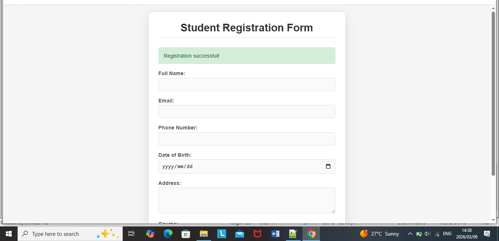
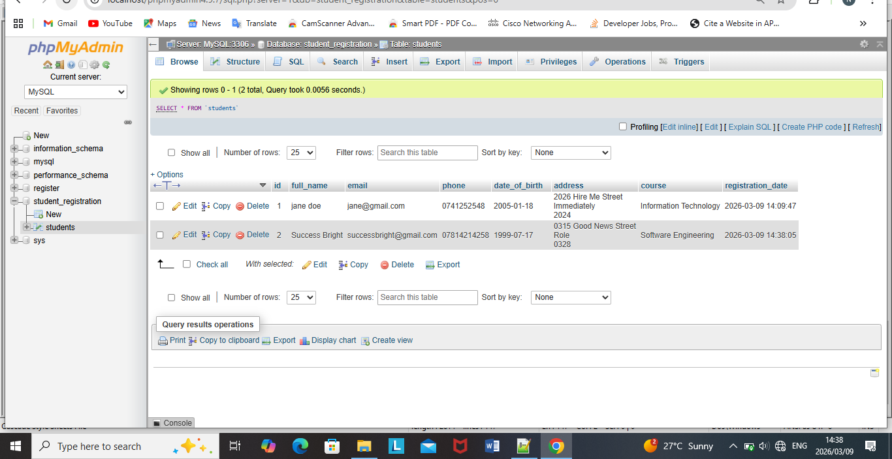
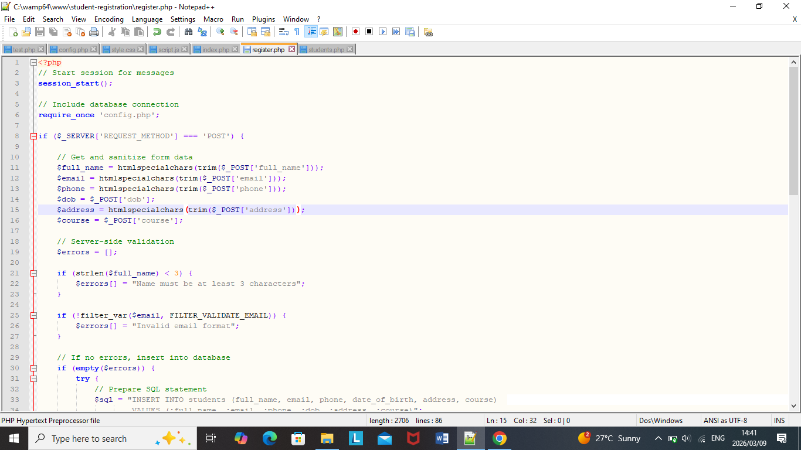
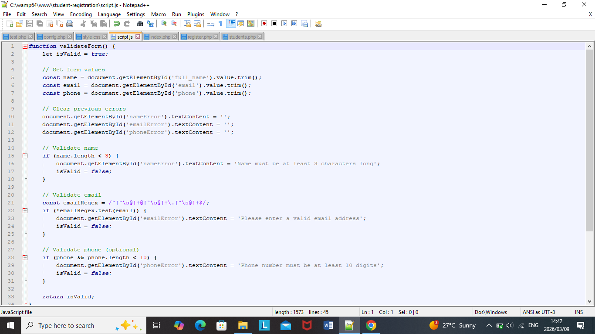
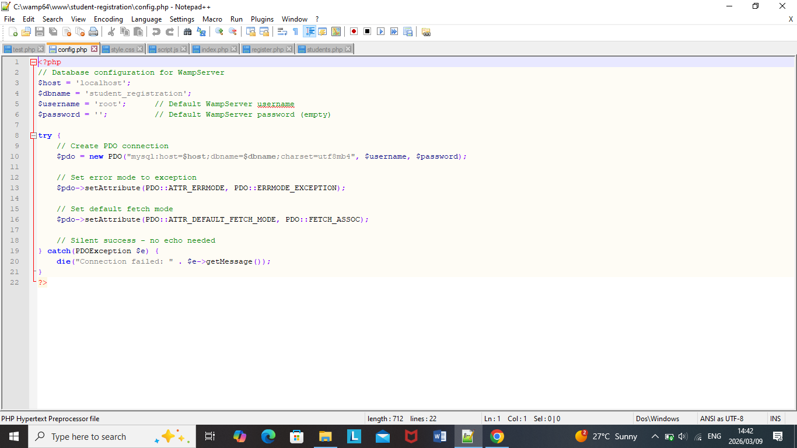
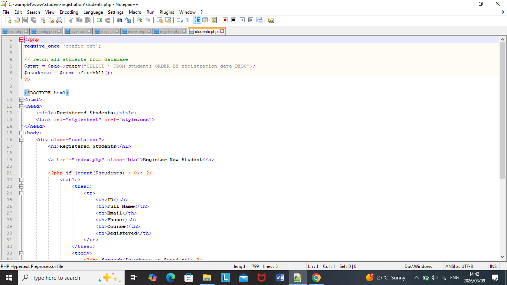
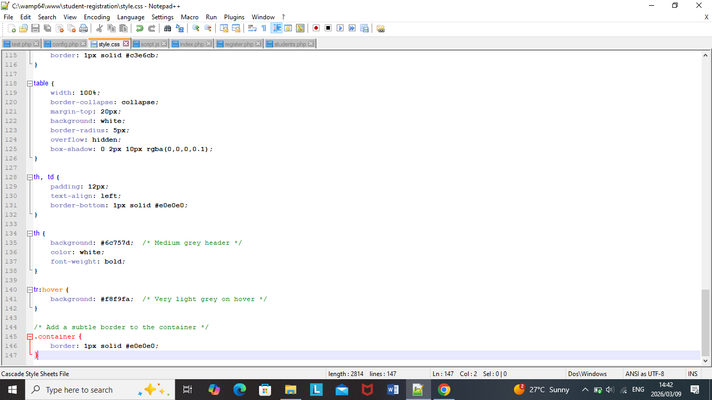

# Student Registration System


A full-stack web application for managing student registrations, built with PHP, MySQL, HTML, CSS, and JavaScript. This project demonstrates secure form handling, database integration, and responsive design.




## Table of Contents
- [Features](#features)
- [Technologies Used](#technologies-used)
- [Screenshots](#screenshots)
- [Installation](#installation)
- [How to Use](#how-to-use)
- [What I Learned](#what-i-learned)
- [Future Improvements](#future-improvements)
- [Contact](#contact)
- [License](#license)

## Features

- **Student Registration Form** with real-time validation
- **Client-side validation** using JavaScript for instant feedback
- **Server-side validation** and SQL injection prevention using prepared statements
- **View All Students** page with formatted table display
- **Responsive design** with clean, professional light grey interface
- **MySQL database** for secure data persistence
- **Success/Error messages** for user feedback

## Technologies Used

| Technology | Purpose |
|------------|---------|
| PHP | Backend processing and server-side logic |
| MySQL | Database management |
| HTML5 | Structure and content |
| CSS3 | Styling and responsive design |
| JavaScript | Client-side validation and interactivity |
| WampServer | Local development environment |
| Git/GitHub | Version control and project hosting |

## Screenshots

### Registration Form


### Students List


### Registration Page


### JavaScript Validation


### Configuration


### Main Page


### Students PHP


### Style CSS


## Installation

### Prerequisites
- WampServer, or any PHP/MySQL environment
- A modern web browser
- A code editor (VS Code, Notepad++, etc.)

### Installation Steps

1. **Clone the repository**
   ```bash
   git clone https://github.com/NasDyan/student-registration.git
2. Move to your wampserver directory    
3. Start WampServer (Apache and MySQL)
4. Create a database called `student_registration` in phpMyAdmin.    
5. Create the students table using this query provided below:
   CREATE TABLE students (
    id INT AUTO_INCREMENT PRIMARY KEY,
    full_name VARCHAR(100) NOT NULL,
    email VARCHAR(100) NOT NULL UNIQUE,
    phone VARCHAR(20),
    date_of_birth DATE,
    address TEXT,
    course VARCHAR(50),
    registration_date TIMESTAMP DEFAULT CURRENT_TIMESTAMP
);

6. Update `config.php` with your database credentials if needed
7. Access the app at `http://localhost/student-registration/`

## How to Use

1. **Register a Student** - Fill in the form and submit
2. **View All Students** - See the list of registered students
3. **Register Another** - Go back and add more
4. **Success Messages** - Green confirmation appears after registration

## What I Learned

- **PHP & MySQL:** Built secure backend with PDO and prepared statements
- **Database Design:** Created normalized tables with proper relationships
- **Validation:** Implemented both client-side (JavaScript) and server-side (PHP) validation
- **Frontend:** Designed responsive UI with HTML, CSS, and JavaScript
- **Security:** Prevented SQL injection using prepared statements
- **Problem Solving:** Debugged issues like file naming errors and broken links.
- **Version Control:** Used Git and GitHub for portfolio hosting
- **Documentation:** Created a professional README for employers

     ### Key Takeaways
  
  - How to build a complete CRUD application using PHP and MySQL
  - The importance of validating user input on both client and server sides
  - How to prevent common security vulnerabilities like SQL injection
  - The value of clean, well-commented code for future maintenance
  - How to present a project professionally to potential employers

This project strengthened my confidence in building real-world applications and prepared me for junior developer roles.

## Contact Me

**Nasiphi Dyani**

**Email:** nasiphidyani3@gmail.com

**LinkedIn:** [linkedin.com/in/nasiphi-dyani-b27474208](https://linkedin.com/in/nasiphi-dyani-b27474208)

**GitHub:** [github.com/NasDyan](https://github.com/NasDyan)

**Project Link:** [github.com/NasDyan/student-registration](https://github.com/NasDyan/student-registration)

I'm actively seeking **Junior Software Developer**, **Software Engineer**, or **Application Developer** opportunities in **Cape Town**, **Gauteng**, or **Remote**. If you're hiring or know someone who is, I'd love to connect!

## License

This project is licensed under the MIT License - see the [LICENSE](LICENSE) file for details.

